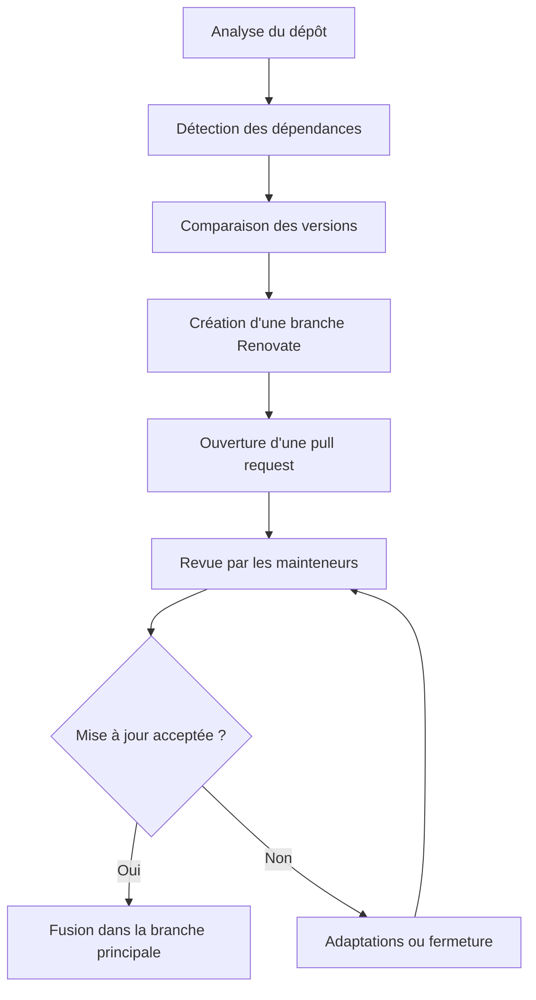

import MermaidDiagram from '@site/src/components/MermaidDiagram';

---
title: Documentation Renovate
description: Documentation de Renovate, un outil d'automatisation de mise à jour de dépendances.
---

## Fonctionnement de Renovate

Renovate est un outil qui automatise la mise à jour des dépendances d'un projet.
Il analyse le dépôt, détecte les nouvelles versions disponibles, puis créé des
branches et des pull requests pour proposer les mises à jour.

Le fonctionnement général se déroule ainsi :

1. Renovate scanne le dépôt et repère les fichiers de dépendances.
2. Il compare les versions installées avec les versions disponibles.
3. Il regroupe ou sépare les mises à jour selon la configuration.
4. Il ouvre une pull request par mise à jour ou par lot de mises à jour.
5. Les mainteneurs valident, ajustent ou fusionnent les changements.

## Fonctionnement avec Medusa

<MermaidDiagram name="fonctionnementRenovate" title="Fonctionnement de Renovate avec Medusa"></MermaidDiagram>

